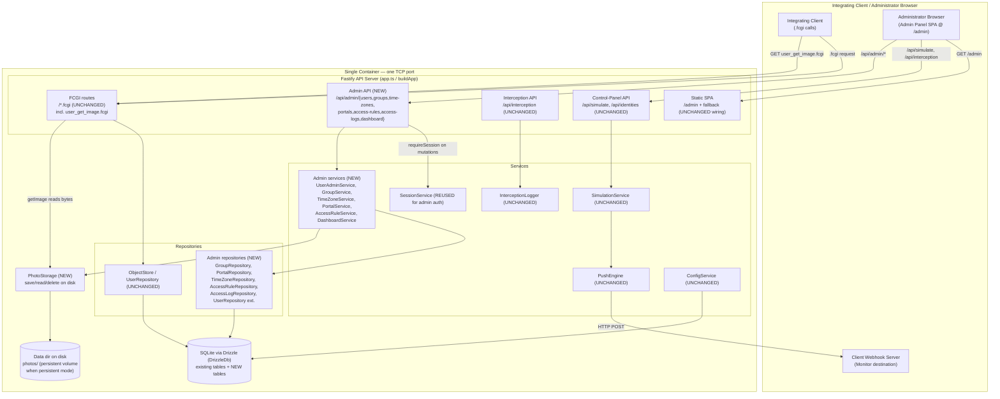

# Design Document: Admin Management Panel

## Overview

### Problem

The Control-iD Facial Emulator (see `.kiro/specs/controlid-facial-emulator/design.md`)
today ships a Control-iD-compatible `.fcgi` API, a Push Engine, an Interception Log, and a
minimal React + Vite control panel served at `/admin` with just two tabs — **Simulate**
(`web/src/components/EventControls.tsx`) and **Interception Log**
(`web/src/components/InterceptionLog.tsx`). Teams integrating with the emulator cannot yet
build and inspect a realistic access-control configuration (Users with photos, Groups,
Time Zones, Access Rules, Portals) the way they would against a real iDSecure device admin
UI.

The **Admin Management Panel** grows that control panel into a cohesive single-page
administration application backed by an expanded relational data model and a new REST
**Admin API** under `/api/admin`. It adds a Dashboard, full CRUD for Users (with real
facial-photo upload), Groups, Time Zones, Access Rules, Portals, and a filterable Access
Logs view — while preserving the existing Simulate and Interception Log sections.

### Goals

- Persist Users, Groups, Time Zones (with Time Ranges), Access Rules, and Portals in the
  existing SQLite database via Drizzle, extending — not replacing — the current tables
  (Req 1).
- Expose an Admin API under `/api/admin/...` implemented in the existing layered
  architecture (routes → services → repositories → db) with thin handlers (Req 13.2).
- Support real facial-photo upload (JPEG/PNG, ≤ 5 MB) stored on disk, served through the
  **existing** `user_get_image.fcgi` endpoint, with no biometric processing (Req 3).
- Protect every administrative mutation with the existing session mechanism; keep reads
  open (Req 10).
- Grow the SPA with client-side navigation across all sections without a full reload
  (Req 11), keeping the existing Simulate + Interception Log behavior intact (Req 12).
- Fit the same single container, the same layered architecture, and the existing CI/CD,
  keeping the image under 200 MB (Req 13).
- Cover the feature with unit, integration, and property-based tests, and preserve the
  existing test suite (Req 14).

### Non-Goals

- **No biometric matching.** A `Facial_Photo` is uploaded, stored, previewed, and served
  for display only. The emulator performs no face detection, enrollment, or 1:N matching
  (Req 3.8, Req 15.1). This is consistent with the base design's "Not a biometric engine"
  non-goal.
- **Extends, does not replace.** The existing `.fcgi` surface, Push Engine, Interception
  Log, and Simulate section keep their exact behavior and shapes (Req 12).
- **Emulated data structures, not a device access engine.** Time Zones, Access Rules,
  Groups, and Portals are persisted data structures for building and integration-testing
  client software, not a faithful reproduction of the device's internal access-decision
  engine (Req 15.3). The emulator does not evaluate whether a given user may pass at a
  given time; it stores and returns the configuration.
- **Single logical device.** One container is one logical device with one `device_id`
  (unchanged from the base design).

### Fidelity Anchor

The primary reference for object concepts and endpoint shapes is the
[Control-iD Access API documentation](https://www.controlid.com.br/docs/access-api-pt/).
The emulated Control-iD concepts and endpoint/webhook shapes are additionally validated
against the official Control-iD integration examples at
[github.com/controlid/integracao](https://github.com/controlid/integracao) (folder
"Controle de Acesso"), including the NodeJS **Monitor**, **Push**, and **Online-server**
samples. In particular, the Monitor sample configures `set_configuration.fcgi` with a
`monitor` block `{ request_timeout, hostname, port, path: "api/notifications" }` and then
receives device notifications at `POST /api/notifications/{dao,door,operation_mode,...}` —
which matches this design's Push Engine target composition (the Monitor destination in the
architecture diagram) and its notification payload catalog. The emulated entities map to
the reference concepts `users`, `groups`, `portals`, `access_rules`, and `time_zones`; the
Requirements Traceability and Design Decisions sections identify each correspondence
(Req 15.4). Where the panel diverges (no biometrics, service-layer referential integrity),
the divergence is called out and must be documented in the README (Req 15).

### Additive, non-regressing

This feature is strictly **additive**. It adds new tables (never dropping or altering
existing columns of `users`, `access_logs`, `config`, `sessions`, `interception_log`),
new `/api/admin` routes, new services, new repositories, and new SPA sections. Every
existing `.fcgi` route, the Push Engine, and the Interception Log keep unchanged request
and response shapes, and the existing automated tests must continue to pass unchanged
(Req 12.1–12.5, Req 14.5).

## Architecture

The emulator remains a single Node.js process in one container serving one TCP port. The
new Admin API is a fifth logical surface alongside the existing `.fcgi` routes, the
Control-Panel API (`/api/simulate`, `/api/identities`), the Interception API
(`/api/interception`), and the static `/admin` SPA. New admin routes delegate to new admin
services (where validation and referential-integrity logic live), which delegate to new
admin repositories over the same `DrizzleDb`. A `PhotoStorage` abstraction writes photo
bytes to disk under the data directory; the existing `user_get_image.fcgi` route reads
them back.



**Boundary note.** Everything inside `Container` is one process and one image. SQLite is
embedded; photo bytes live on the same filesystem (a mounted volume in persistent mode).
The only network egress remains the Push Engine's POST to the client's Monitor server —
unchanged by this feature.

### Request flows

- **Admin read (open):** browser → `GET /api/admin/<resource>` → admin service →
  admin repository → `DrizzleDb` → JSON response. No session required (Req 10.3).
- **Admin mutation (protected):** browser → `POST|PUT|DELETE /api/admin/<resource>` →
  `requireSession` preHandler (reuses `makeRequireSession` from
  `routes/fcgi/session-routes.ts`) → admin service (validates, enforces referential
  integrity) → admin repository (transactional write) → JSON response (Req 10.2, 10.4).
- **Photo upload:** browser multipart POST → `@fastify/multipart` (5 MB limit) →
  `UserAdminService.setPhoto` → `PhotoStorage.save` writes the file and returns a path →
  `UserRepository` sets `users.image_path` → `200` (Req 3.1).
- **Photo retrieval (unchanged endpoint):** integrating client or SPA →
  `GET /user_get_image.fcgi?user_id=` → existing `object-routes.ts` handler →
  `UserRepository.getImage` now delegates to `PhotoStorage.read` → image bytes with the
  correct content type (Req 3.5).
- **Inbound tap:** the existing `onResponse` tap in `app.ts` already records any path that
  `endsWith('.fcgi')` **or** `startsWith('/api')`, so every `/api/admin` request is
  automatically intercepted with no change to the tap (Req 8.1 behavior preserved).

## Technology Stack and Rationale (additions only)

Everything from the base stack is reused **exactly**: Node 22 + TypeScript (ESM, `.js`
import extensions, strict, `verbatimModuleSyntax`, `consistent-type-imports`), Fastify 5,
Drizzle ORM + better-sqlite3, React 18 + Vite, vitest + fast-check, the multi-stage
Dockerfile, and the GitHub Actions CI/CD. Only the following are added:

| Concern | Choice | Rationale |
|---|---|---|
| Multipart upload | **`@fastify/multipart`** (`^9`, compatible with Fastify 5) | Facial-photo upload needs `multipart/form-data`. Fastify's built-in parsers (in `app.ts`) only handle `application/json`, `x-www-form-urlencoded`, and a `*` string fallback — none stream a file part. `@fastify/multipart` integrates natively with Fastify's plugin/hook model, exposes a `limits.fileSize` cap that yields the 5 MB → `413` behavior (Req 3.3), and reports the part `mimetype` for JPEG/PNG validation (Req 3.2). It is a small, well-maintained first-party plugin — consistent with the existing `@fastify/static` choice — and keeps the image small. **This is the only new runtime dependency on the API side.** |
| Client-side routing | **Lightweight in-app state router (no new dependency)** | The SPA needs to switch between nine sections without a full reload (Req 11.3) and resolve deep links under `/admin/*` (Req 11.4). Rather than add `react-router` (extra bundle weight and API surface), we extend the existing `useState`-based tab pattern in `App.tsx` into a small `useHashRoute` hook driven by `window.location.hash` (`#/users`, `#/groups`, …). Hash routing needs no server cooperation — the existing static fallback in `routes/static.ts` already serves `index.html` for any `/admin/*` path (Req 11.4) — so it works with the current server unchanged and adds zero dependencies, keeping the image under 200 MB (Req 13.5). If richer routing is later needed, `react-router` can be swapped in behind the same hook boundary. |
| Photo storage | **Disk (Node `fs`), no new dependency** | Photos are written under a configurable data dir using Node's built-in `fs`. See Design Decisions for the disk-vs-DB trade-off. |

No new frontend runtime dependency is introduced; `react` / `react-dom` are reused.

## Data Models

All new tables are added to `api/src/db/schema.ts` (the single source of truth) and to the
idempotent `CREATE TABLE IF NOT EXISTS` DDL in `api/src/db/connection.ts` (`createTables`),
matching the existing convention that keeps raw DDL in sync with the schema. **No existing
column is dropped or altered** (Req 1.5). The existing `users` and `access_logs` tables are
kept as-is; the new tables reference `users` (for group membership) and are referenced by
join tables.

Foreign keys are declared with Drizzle `.references(...)` and are enforced at the DB level
because `connection.ts` already sets `PRAGMA foreign_keys = ON` for both modes. **Owned
children** (a Time Zone's `time_ranges`, and all `*_groups` / `*_time_zones` /
`*_portals` / `users_groups` join rows) use `ON DELETE CASCADE` so deleting the owner
cleans up its own rows. **Referential integrity against Access Rules** (you may not delete
a Group/Time Zone/Portal that an Access Rule still references) is enforced in the **service
layer** returning `409`, not by a DB constraint — see Design Decisions for why (Req 7.7).

### Drizzle schema additions (`api/src/db/schema.ts`)

```typescript
import { sqliteTable, integer, text, primaryKey } from 'drizzle-orm/sqlite-core';
// (existing imports: config, users, accessLogs, sessions, interceptionLog stay unchanged)

// --- Groups (Control-iD `groups`) ---
export const groups = sqliteTable('groups', {
  id: integer('id').primaryKey({ autoIncrement: true }),
  name: text('name').notNull(),
});

// User↔Group membership: many-to-many (Req 1.2). Composite PK prevents dup rows.
export const usersGroups = sqliteTable(
  'users_groups',
  {
    userId: integer('user_id')
      .notNull()
      .references(() => users.id, { onDelete: 'cascade' }),
    groupId: integer('group_id')
      .notNull()
      .references(() => groups.id, { onDelete: 'cascade' }),
  },
  (t) => ({ pk: primaryKey({ columns: [t.userId, t.groupId] }) }),
);

// --- Portals (Control-iD `portals`; doors) ---
export const portals = sqliteTable('portals', {
  id: integer('id').primaryKey({ autoIncrement: true }),
  name: text('name').notNull(),
});

// --- Time Zones (Control-iD `time_zones`; horários) ---
export const timeZones = sqliteTable('time_zones', {
  id: integer('id').primaryKey({ autoIncrement: true }),
  name: text('name').notNull(),
});

// A Time Range belongs to exactly one Time Zone (owned child; cascade on delete).
// `days` is a 7-bit mask (bit 0 = Sunday … bit 6 = Saturday); start/end are 'HH:MM'.
export const timeRanges = sqliteTable('time_ranges', {
  id: integer('id').primaryKey({ autoIncrement: true }),
  timeZoneId: integer('time_zone_id')
    .notNull()
    .references(() => timeZones.id, { onDelete: 'cascade' }),
  days: integer('days').notNull(), // 7-bit weekday mask, 1..127
  startTime: text('start_time').notNull(), // 'HH:MM' 24-hour
  endTime: text('end_time').notNull(), // 'HH:MM' 24-hour, strictly after startTime
});

// --- Access Rules (Control-iD `access_rules`) ---
export const accessRules = sqliteTable('access_rules', {
  id: integer('id').primaryKey({ autoIncrement: true }),
  name: text('name').notNull(),
});

// Access Rule associations: three many-to-many join tables (Req 1.3, 7).
export const accessRuleGroups = sqliteTable(
  'access_rule_groups',
  {
    accessRuleId: integer('access_rule_id')
      .notNull()
      .references(() => accessRules.id, { onDelete: 'cascade' }),
    groupId: integer('group_id')
      .notNull()
      .references(() => groups.id, { onDelete: 'restrict' }),
  },
  (t) => ({ pk: primaryKey({ columns: [t.accessRuleId, t.groupId] }) }),
);

export const accessRuleTimeZones = sqliteTable(
  'access_rule_time_zones',
  {
    accessRuleId: integer('access_rule_id')
      .notNull()
      .references(() => accessRules.id, { onDelete: 'cascade' }),
    timeZoneId: integer('time_zone_id')
      .notNull()
      .references(() => timeZones.id, { onDelete: 'restrict' }),
  },
  (t) => ({ pk: primaryKey({ columns: [t.accessRuleId, t.timeZoneId] }) }),
);

export const accessRulePortals = sqliteTable(
  'access_rule_portals',
  {
    accessRuleId: integer('access_rule_id')
      .notNull()
      .references(() => accessRules.id, { onDelete: 'cascade' }),
    portalId: integer('portal_id')
      .notNull()
      .references(() => portals.id, { onDelete: 'restrict' }),
  },
  (t) => ({ pk: primaryKey({ columns: [t.accessRuleId, t.portalId] }) }),
);
```

The new tables are added to the exported `schema` object and given inferred row types
(`GroupRow`, `GroupInsert`, `PortalRow`, `TimeZoneRow`, `TimeRangeRow`, `AccessRuleRow`,
etc.) following the existing `$inferSelect` / `$inferInsert` pattern.

**On the `onDelete` choices.** Join rows toward the *owning* Access Rule cascade (deleting
an Access Rule removes its own association rows — Req 7.8). Join columns pointing at
Groups/Time Zones/Portals use `restrict` as a **defense-in-depth backstop**; the
authoritative check is the service-layer `409` (Req 7.7), which runs first and produces
the required `error-description` naming the referencing Access Rules. `users_groups` and
`time_ranges` cascade fully because Users own their memberships (Req 2.8) and Time Zones
own their ranges (Req 5.8).

### Idempotent DDL additions (`api/src/db/connection.ts` → `CREATE_TABLE_STATEMENTS`)

These statements are appended to the existing `CREATE_TABLE_STATEMENTS` array so
`createTables(db)` remains idempotent and runs on every startup, creating any missing
table before the server accepts an Admin API request (Req 1.6). Order matters: parent
tables precede tables that reference them.

```sql
CREATE TABLE IF NOT EXISTS groups (
  id INTEGER PRIMARY KEY AUTOINCREMENT,
  name TEXT NOT NULL
);

CREATE TABLE IF NOT EXISTS users_groups (
  user_id INTEGER NOT NULL REFERENCES users(id) ON DELETE CASCADE,
  group_id INTEGER NOT NULL REFERENCES groups(id) ON DELETE CASCADE,
  PRIMARY KEY (user_id, group_id)
);

CREATE TABLE IF NOT EXISTS portals (
  id INTEGER PRIMARY KEY AUTOINCREMENT,
  name TEXT NOT NULL
);

CREATE TABLE IF NOT EXISTS time_zones (
  id INTEGER PRIMARY KEY AUTOINCREMENT,
  name TEXT NOT NULL
);

CREATE TABLE IF NOT EXISTS time_ranges (
  id INTEGER PRIMARY KEY AUTOINCREMENT,
  time_zone_id INTEGER NOT NULL REFERENCES time_zones(id) ON DELETE CASCADE,
  days INTEGER NOT NULL,
  start_time TEXT NOT NULL,
  end_time TEXT NOT NULL
);

CREATE TABLE IF NOT EXISTS access_rules (
  id INTEGER PRIMARY KEY AUTOINCREMENT,
  name TEXT NOT NULL
);

CREATE TABLE IF NOT EXISTS access_rule_groups (
  access_rule_id INTEGER NOT NULL REFERENCES access_rules(id) ON DELETE CASCADE,
  group_id INTEGER NOT NULL REFERENCES groups(id) ON DELETE RESTRICT,
  PRIMARY KEY (access_rule_id, group_id)
);

CREATE TABLE IF NOT EXISTS access_rule_time_zones (
  access_rule_id INTEGER NOT NULL REFERENCES access_rules(id) ON DELETE CASCADE,
  time_zone_id INTEGER NOT NULL REFERENCES time_zones(id) ON DELETE RESTRICT,
  PRIMARY KEY (access_rule_id, time_zone_id)
);

CREATE TABLE IF NOT EXISTS access_rule_portals (
  access_rule_id INTEGER NOT NULL REFERENCES access_rules(id) ON DELETE CASCADE,
  portal_id INTEGER NOT NULL REFERENCES portals(id) ON DELETE RESTRICT,
  PRIMARY KEY (access_rule_id, portal_id)
);
```

The existing `users` and `access_logs` DDL is left untouched; `access_logs.portal_id`
continues to be a free-form string field (kept as-is per the brief), and `Portal` is a new
managed entity that the `portal_id` value conceptually references.

## Components and Interfaces

All interfaces are TypeScript (ESM, `.js` import specifiers). New repositories and services
are constructed in `buildContainer` (`api/src/composition/container.ts`) and added to the
`Container` interface, so route handlers stay thin translators — matching the existing
design where "all business logic stays in the services reachable through the `Container`."
Validation and referential-integrity logic live in the **services**; repositories perform
typed reads/writes over `DrizzleDb`.

### Domain error additions (`api/src/routes/errors.ts`)

Two new `HttpError` subclasses are added next to `BadRequestError` / `UnauthorizedError`,
and both the `instanceof` fast path and the name-based `switch` in `classify()` gain cases
for them (so they map correctly even under the duplicate-class-identity fallback the file
documents):

```typescript
/** Convenience: a `404 Not Found` with an `error-description`. */
export class NotFoundError extends HttpError {
  public constructor(description: string) {
    super(404, description);
    this.name = 'NotFoundError';
    Object.setPrototypeOf(this, NotFoundError.prototype);
  }
}

/** Convenience: a `409 Conflict` for referential-integrity violations (Req 7.7). */
export class ConflictError extends HttpError {
  public constructor(description: string) {
    super(409, description);
    this.name = 'ConflictError';
    Object.setPrototypeOf(this, ConflictError.prototype);
  }
}
```

`classify()` already honors any `HttpError`'s `statusCode` via both layers; the name-based
`switch` adds `case 'NotFoundError':` and `case 'ConflictError':` that read the carried
`statusCode` (falling back to 404 / 409). A `413` for oversize uploads is produced by a
`PayloadTooLargeError extends HttpError` (status 413) OR by mapping `@fastify/multipart`'s
`FST_REQ_FILE_TOO_LARGE` error (which surfaces as a `FastifyError` with
`statusCode === 413`) — Layer 3 of `classify()` already honors any 4xx `FastifyError`
status, so a `413` renders as `413` with an `error-description` automatically. The photo
handler additionally catches the multipart limit to attach a clear message (Req 3.3).

### PhotoStorage (new, `api/src/repositories/photo-storage.ts`)

A thin filesystem abstraction that owns the on-disk photo layout. It is the only component
that touches photo files, so the storage location and naming are centralized.

```typescript
export type PhotoMime = 'image/jpeg' | 'image/png';

export interface StoredPhoto {
  /** Path persisted in users.image_path, relative to the photos dir root. */
  relativePath: string;
  mime: PhotoMime;
}

export interface PhotoStorage {
  /** Persist bytes for a user, overwriting any prior photo; returns the stored path. */
  save(userId: number, bytes: Buffer, mime: PhotoMime): Promise<StoredPhoto>;
  /** Read stored bytes + mime for a user, or null when none / file missing. */
  read(userId: number): Promise<{ bytes: Buffer; mime: PhotoMime } | null>;
  /** Delete a user's stored photo file if present (idempotent). */
  delete(userId: number): Promise<void>;
}
```

Implementation notes:
- Root dir resolved from `EMULATOR_DATA_DIR` if set, else the directory of
  `EMULATOR_DB_PATH` (`dirname(resolved.dbPath)`), else a temp dir in ephemeral mode; the
  concrete `photos/` subfolder is created on first write. In persistent mode this lives on
  the mounted volume so photos survive restarts (Req 13.3).
- File name is derived from the user id plus an extension inferred from mime
  (`<userId>.jpg` / `<userId>.png`); `image_path` stores the relative path. Because names
  are keyed by user id, a re-upload overwrites and `delete` is a simple unlink.
- The mime is recoverable from the stored extension so `read` can report the correct
  content type for `user_get_image.fcgi` (Req 3.5).

### UserRepository extensions (`api/src/repositories/user-repository.ts`)

The existing `UserRepository` keeps `list()`, `appendAccessLog()`, and `getBiometry()`
unchanged. `getImage(userId)` is upgraded from its documented stub to delegate to
`PhotoStorage.read`, returning the real bytes (and, via a small companion, the mime) so the
existing `user_get_image.fcgi` route serves stored photos (Req 3.5). New methods support
admin User CRUD and group membership:

```typescript
export interface AdminUserView {
  id: number;
  registration: string;
  name: string;
  hasPhoto: boolean;          // Req 2.4
  groupIds: number[];         // Req 2.4, 2.5
}

export interface UserWrite {
  registration: string;
  name: string;
  pin?: string;               // stored in users.password (Req 2.2)
  groupIds: number[];         // membership set to replace (Req 2.7)
}

interface UserRepository {
  // existing: list(), getImage(), getBiometry(), appendAccessLog()
  getImageWithMime(userId: number): Promise<{ bytes: Buffer; mime: PhotoMime } | null>;
  listAdmin(): Promise<AdminUserView[]>;                       // Req 2.4
  getAdmin(id: number): Promise<AdminUserView | null>;         // Req 2.5, 2.6
  create(write: UserWrite): Promise<AdminUserView>;            // Req 2.1
  update(id: number, write: UserWrite): Promise<AdminUserView>;// Req 2.7
  delete(id: number): Promise<void>;   // also removes users_groups rows (Req 2.8)
  setImagePath(id: number, path: string | null): Promise<void>;// Req 3.1, 3.6
  existingIds(ids: number[]): Promise<Set<number>>;            // validate membership (Req 4.7)
}
```

### GroupRepository (new)

```typescript
export interface GroupView { id: number; name: string; memberCount: number; } // Req 4.3
export interface GroupDetail { id: number; name: string; members: AdminUserView[]; } // Req 4.4

interface GroupRepository {
  list(): Promise<GroupView[]>;
  get(id: number): Promise<GroupDetail | null>;
  create(name: string): Promise<GroupDetail>;
  update(id: number, name: string, memberIds: number[]): Promise<GroupDetail>; // Req 4.6
  delete(id: number): Promise<void>;               // cascades users_groups (Req 4.8)
  referencingAccessRules(id: number): Promise<number[]>; // for 409 (Req 7.7)
}
```

### PortalRepository (new)

```typescript
export interface PortalView { id: number; name: string; }

interface PortalRepository {
  list(): Promise<PortalView[]>;
  get(id: number): Promise<PortalView | null>;
  create(name: string): Promise<PortalView>;
  update(id: number, name: string): Promise<PortalView>;
  delete(id: number): Promise<void>;
  referencingAccessRules(id: number): Promise<number[]>; // for 409 (Req 7.7)
}
```

### TimeZoneRepository (new)

```typescript
export interface TimeRangeView {
  id: number;
  days: string[];        // e.g. ['mon','tue'] — decoded from the 7-bit mask
  startTime: string;     // 'HH:MM'
  endTime: string;       // 'HH:MM'
}
export interface TimeZoneView { id: number; name: string; timeRanges: TimeRangeView[]; }

export interface TimeRangeWrite { days: string[]; startTime: string; endTime: string; }

interface TimeZoneRepository {
  list(): Promise<TimeZoneView[]>;                 // Req 5.5
  get(id: number): Promise<TimeZoneView | null>;   // Req 5.6
  create(name: string, ranges: TimeRangeWrite[]): Promise<TimeZoneView>;   // Req 5.1
  update(id: number, name: string, ranges: TimeRangeWrite[]): Promise<TimeZoneView>; // Req 5.7
  delete(id: number): Promise<void>;               // cascades time_ranges (Req 5.8)
  referencingAccessRules(id: number): Promise<number[]>; // for 409 (Req 7.7)
}
```

`TimeRangeWrite.days` (string weekday names) is validated and encoded to the 7-bit mask by
`TimeZoneService` before persistence; `TimeRangeView.days` is decoded back on read.

### AccessRuleRepository (new)

```typescript
export interface AccessRuleView {
  id: number;
  name: string;
  groupIds: number[];
  timeZoneIds: number[];
  portalIds: number[];
}
export interface AccessRuleWrite {
  name: string;
  groupIds: number[];
  timeZoneIds: number[];
  portalIds: number[];
}

interface AccessRuleRepository {
  list(): Promise<AccessRuleView[]>;               // Req 7.4
  get(id: number): Promise<AccessRuleView | null>; // Req 7.5
  create(write: AccessRuleWrite): Promise<AccessRuleView>; // Req 7.1
  update(id: number, write: AccessRuleWrite): Promise<AccessRuleView>; // Req 7.6
  delete(id: number): Promise<void>;   // cascades association rows only (Req 7.8)
}
```

### AccessLogRepository (new)

Reads only; the existing `access_logs` table is the source. Filtering + newest-first
ordering for the Access Logs view and the Dashboard.

```typescript
export interface AccessLogFilter {
  userId?: string;    // Req 8.2
  event?: string;     // Req 8.3 (one of ACCESS_EVENT codes)
  from?: number;      // inclusive lower bound, epoch seconds (Req 8.4)
  to?: number;        // inclusive upper bound, epoch seconds (Req 8.4)
}

interface AccessLogRepository {
  query(filter: AccessLogFilter): Promise<AccessLogRecord[]>; // ordered time DESC (Req 8.1)
  recent(limit: number): Promise<AccessLogRecord[]>;          // newest-first (Req 9.2)
}
```

Records are returned as the existing `AccessLogRecord` shape (all-string device shape) so
the SPA and any client see the same envelope as `load_objects.fcgi`.

### Admin services (new)

Validation and referential integrity live here. Each service throws the shared domain
errors so the **existing** `classify()` maps them to the right status:

- `UserAdminService` — field validation (registration 1–64, name 1–128; Req 2.1, 2.3),
  PIN → `password` (Req 2.2), membership id existence (Req 4.7 for group side is checked in
  `GroupService`; for user create/update the submitted `groupIds` are validated to exist),
  `NotFoundError` on unknown id (Req 2.6), photo save/delete orchestration (Req 3),
  cascade of memberships and photo on delete (Req 2.8, 3.7).
- `GroupService` — name validation (Req 4.2), member-id existence → `BadRequestError`
  naming the invalid id (Req 4.7), `NotFoundError` (Req 4.5), `ConflictError` when deleting
  a referenced Group (Req 7.7 / 4.8).
- `TimeZoneService` — name validation (Req 5.1), Time Range validation (`HH:MM` format,
  `start < end`, ≥ 1 valid weekday; Req 5.2–5.4) with weekday-name ⇄ bitmask encoding,
  `NotFoundError` (Req 5.6), `ConflictError` on referenced delete (Req 7.7 / 5.8).
- `PortalService` — name validation (Req 6.2), `NotFoundError` (Req 6.4), `ConflictError`
  on referenced delete (Req 7.7 / 6.6).
- `AccessRuleService` — name validation, non-empty group/time-zone/portal sets (Req 7.3),
  existence of every referenced id (Req 7.2) → `BadRequestError` naming the missing
  reference, `NotFoundError` (Req 7.5).
- `DashboardService` — aggregate counts (Users, Groups, Access Rules, Portals; zero when
  empty, Req 9.3) + 10 most-recent logs via `AccessLogRepository.recent(10)` (Req 9.1, 9.2).

A small shared `validation.ts` module (services layer) holds the reusable primitives:
`validateName(field, value, max)`, `parseHhMm(value)`, `WEEKDAYS`, `daysToMask/maskToDays`,
`validateTimeRange(write)`. These are pure functions — the natural target for unit and
property tests (Req 14.1, 14.3).

### Container wiring (`api/src/composition/container.ts`)

`buildContainer` gains the new repositories/services and `PhotoStorage`, and the
`Container` interface is extended. `PhotoStorage` needs the data-dir root, so
`buildContainer` receives it from `ResolvedConfig` (a new `dataDir` field derived in
`bootstrap.ts` from `EMULATOR_DATA_DIR` or `dirname(dbPath)`). `BuildContainerOverrides`
gains an optional `photoStorage` seam so tests can inject an in-memory implementation.

```typescript
export interface Container {
  // existing: config, sessions, logger, pushEngine, objectStore, users, simulation
  readonly photos: PhotoStorage;             // NEW
  readonly groups: GroupService;             // NEW
  readonly portals: PortalService;           // NEW
  readonly timeZones: TimeZoneService;       // NEW
  readonly accessRules: AccessRuleService;   // NEW
  readonly userAdmin: UserAdminService;      // NEW
  readonly dashboard: DashboardService;      // NEW
  readonly accessLogs: AccessLogRepository;  // NEW (read-only)
}
```

`UserRepository` is upgraded in place (still constructed once) and injected into both the
existing consumers and the new `UserAdminService`; `PhotoStorage` is injected into
`UserRepository` (for `getImageWithMime`/`getImage`) and `UserAdminService`.

### Admin route registration (`api/src/routes/admin/*`, wired in `app.ts`)

A new `registerAdminRoutes(app, container, requireSession)` is called from `buildApp`
**after** the existing route registrations and **before** the awaited
`registerStaticAssets` — preserving the critical ordering the file documents (error/404
handlers installed before the awaited `@fastify/static`). `@fastify/multipart` is
registered inside `registerAdminRoutes` (scoped, with the 5 MB `limits.fileSize`). Mutations
attach the shared `requireSession` preHandler produced by `makeRequireSession(container)`;
reads attach none (Req 10.2, 10.3).

## Admin API Endpoint Specification

Base path `/api/admin`. Request/response bodies are `application/json` except photo upload
(`multipart/form-data`) and `user_get_image.fcgi` (unchanged, octet-stream). Session token
for mutations is read exactly as the existing `makeRequireSession` reads it — from
`?session=<token>` (query) or a `session` body field — so the admin surface is consistent
with the `.fcgi` surface (Req 10.2). Error bodies use the existing `{ "error-description": ... }`
contract. `error-description` names the offending field/reference on 400/404/409/413.

### Users (Req 2, 3)

| Method | Path | Auth | Request | Success | Errors |
|---|---|---|---|---|---|
| GET | `/api/admin/users` | none | — | `200` `AdminUserView[]` (id, registration, name, hasPhoto, groupIds) | — |
| POST | `/api/admin/users` | session | `{ registration, name, pin?, groupIds? }` | `201` `AdminUserView` | `400` invalid field / unknown groupId, `401` |
| GET | `/api/admin/users/:id` | none | — | `200` `AdminUserView` | `404` |
| PUT | `/api/admin/users/:id` | session | `{ registration, name, pin?, groupIds }` | `200` `AdminUserView` | `400`, `401`, `404` |
| DELETE | `/api/admin/users/:id` | session | — | `200` `{ deleted: true }` | `401`, `404` |
| POST | `/api/admin/users/:id/photo` | session | `multipart/form-data` file part | `200` `{ hasPhoto: true }` | `400` bad mime, `401`, `404`, `413` too large |
| DELETE | `/api/admin/users/:id/photo` | session | — | `200` `{ hasPhoto: false }` | `401`, `404` |

### Groups (Req 4)

| Method | Path | Auth | Request | Success | Errors |
|---|---|---|---|---|---|
| GET | `/api/admin/groups` | none | — | `200` `GroupView[]` (id, name, memberCount) | — |
| POST | `/api/admin/groups` | session | `{ name }` | `201` `GroupDetail` | `400`, `401` |
| GET | `/api/admin/groups/:id` | none | — | `200` `GroupDetail` (members[]) | `404` |
| PUT | `/api/admin/groups/:id` | session | `{ name, memberIds }` | `200` `GroupDetail` | `400` (bad name / unknown memberId), `401`, `404` |
| DELETE | `/api/admin/groups/:id` | session | — | `200` `{ deleted: true }` | `401`, `404`, `409` referenced by Access Rule |

### Portals (Req 6)

| Method | Path | Auth | Request | Success | Errors |
|---|---|---|---|---|---|
| GET | `/api/admin/portals` | none | — | `200` `PortalView[]` | — |
| POST | `/api/admin/portals` | session | `{ name }` | `201` `PortalView` | `400`, `401` |
| GET | `/api/admin/portals/:id` | none | — | `200` `PortalView` | `404` |
| PUT | `/api/admin/portals/:id` | session | `{ name }` | `200` `PortalView` | `400`, `401`, `404` |
| DELETE | `/api/admin/portals/:id` | session | — | `200` `{ deleted: true }` | `401`, `404`, `409` |

### Time Zones (Req 5)

| Method | Path | Auth | Request | Success | Errors |
|---|---|---|---|---|---|
| GET | `/api/admin/time-zones` | none | — | `200` `TimeZoneView[]` | — |
| POST | `/api/admin/time-zones` | session | `{ name, timeRanges: [{ days[], startTime, endTime }] }` | `201` `TimeZoneView` | `400` (name / HH:MM / start≥end / no valid day), `401` |
| GET | `/api/admin/time-zones/:id` | none | — | `200` `TimeZoneView` | `404` |
| PUT | `/api/admin/time-zones/:id` | session | `{ name, timeRanges }` | `200` `TimeZoneView` | `400`, `401`, `404` |
| DELETE | `/api/admin/time-zones/:id` | session | — | `200` `{ deleted: true }` | `401`, `404`, `409` |

### Access Rules (Req 7)

| Method | Path | Auth | Request | Success | Errors |
|---|---|---|---|---|---|
| GET | `/api/admin/access-rules` | none | — | `200` `AccessRuleView[]` | — |
| POST | `/api/admin/access-rules` | session | `{ name, groupIds[], timeZoneIds[], portalIds[] }` | `201` `AccessRuleView` | `400` (bad name / empty set / unknown reference), `401` |
| GET | `/api/admin/access-rules/:id` | none | — | `200` `AccessRuleView` | `404` |
| PUT | `/api/admin/access-rules/:id` | session | `{ name, groupIds[], timeZoneIds[], portalIds[] }` | `200` `AccessRuleView` | `400`, `401`, `404` |
| DELETE | `/api/admin/access-rules/:id` | session | — | `200` `{ deleted: true }` | `401`, `404` |

### Access Logs (Req 8) & Dashboard (Req 9)

| Method | Path | Auth | Request | Success | Errors |
|---|---|---|---|---|---|
| GET | `/api/admin/access-logs` | none | `?user_id=&event=&from=&to=` (all optional; ISO date or epoch) | `200` `AccessLogRecord[]` newest-first; `[]` when none | `400` invalid filter value naming the parameter |
| GET | `/api/admin/dashboard` | none | — | `200` `{ counts: { users, groups, accessRules, portals }, recentLogs: AccessLogRecord[] }` | — |

`:id` path params are validated as positive integers; a non-integer id yields `400`
(naming `id`). Unknown `/api/admin/*` paths fall through to the existing global `404`
handler; wrong methods fall through to Fastify's default `405`/`404` (no `.fcgi` catch-all
applies to admin paths). Reads never require a session (Req 10.3); every listed mutation is
guarded by `requireSession` → `401` on absent/empty/malformed/expired token (Req 10.2, 10.4).

## Photo Upload & Retrieval Design

### Upload (`POST /api/admin/users/:id/photo`)

- `@fastify/multipart` is registered with `limits: { fileSize: 5 * 1024 * 1024, files: 1 }`
  (5 MB, single file). When a part exceeds the limit the plugin raises
  `FST_REQ_FILE_TOO_LARGE` (a `FastifyError` with `statusCode === 413`); `classify()`
  Layer 3 renders it as `413` with an `error-description`, and the handler adds the explicit
  message "Facial photo must not exceed 5 MB." (Req 3.3). No file is written because the
  handler validates before calling `PhotoStorage.save`.
- Accepted MIME types are `image/jpeg` and `image/png` only. The handler inspects the
  part's reported `mimetype` **and** sniffs the leading magic bytes (JPEG `FF D8 FF`, PNG
  `89 50 4E 47`) to avoid trusting the client-declared type; anything else →
  `BadRequestError` "Accepted formats: JPEG, PNG." → `400`, and no file is written
  (Req 3.2).
- On success `UserAdminService.setPhoto` first confirms the User exists (`404` otherwise,
  Req 2.6), calls `PhotoStorage.save(userId, bytes, mime)`, then
  `UserRepository.setImagePath(userId, storedPath)`, and returns `200` (Req 3.1). Re-upload
  overwrites the prior file (same id-keyed name).

### Retrieval (existing `GET /user_get_image.fcgi`)

The existing route in `api/src/routes/fcgi/object-routes.ts` is unchanged in shape and auth.
Its handler calls `container.users.getImage(userId)`; `getImage` now delegates to
`PhotoStorage.read` and returns the stored bytes. The handler is extended minimally to set
the content type from the stored mime (`image/jpeg` / `image/png`) instead of a fixed
`application/octet-stream`, so the response content type matches the stored format
(Req 3.5). When no photo is stored it still returns `404` with `error-description`, exactly
as today (documented existing behavior — no regression).

### Deletion

- `DELETE /api/admin/users/:id/photo` → `PhotoStorage.delete(userId)` then
  `UserRepository.setImagePath(userId, null)` → `200` (Req 3.6).
- Deleting a User (`DELETE /api/admin/users/:id`) calls `PhotoStorage.delete(userId)` as
  part of the same operation so the stored file is removed with the record (Req 3.7); the
  `users_groups` rows are removed by FK cascade (Req 2.8).

### No biometrics

`PhotoStorage`, `UserAdminService`, and `UserRepository` only store, read, and delete photo
bytes. No component performs face detection, template extraction, enrollment, or matching
on any stored photo; the bytes are used solely for storage, display, and retrieval
(Req 3.8, Req 15.1). The existing `getBiometry` stub remains a synthetic, non-biometric
placeholder.

### Persistence

In persistent mode the photos dir sits under the mounted volume (`EMULATOR_DATA_DIR` or
`dirname(EMULATOR_DB_PATH)`), so stored photos and their `image_path` references survive a
container restart alongside the SQLite file (Req 13.3). In ephemeral mode photos go to a
temp dir discarded with the process.

## Frontend (web/) Design

### Navigation and routing

`web/src/App.tsx` grows from a two-value `useState<Tab>` into a small sidebar/nav layout
driven by a new `useHashRoute` hook that reads/writes `window.location.hash`
(`#/dashboard`, `#/users`, `#/groups`, `#/time-zones`, `#/access-rules`, `#/portals`,
`#/access-logs`, `#/simulate`, `#/interception`). A persistent left sidebar (collapsing to
a top bar on narrow viewports) lists all nine sections (Req 11.2); selecting one swaps the
rendered section component with no full reload (Req 11.3). Because routing is hash-based,
the existing `routes/static.ts` fallback (serves `index.html` for any `/admin/*`) already
satisfies deep-link resolution (Req 11.4) with no server change. The default route is
`#/dashboard`.

### Sections

| Section | Component (new unless noted) | Data source |
|---|---|---|
| Dashboard | `Dashboard.tsx` | `GET /api/admin/dashboard` |
| Users | `UsersSection.tsx` + `UserForm.tsx` | `/api/admin/users`, photo endpoints |
| Groups | `GroupsSection.tsx` + `GroupForm.tsx` | `/api/admin/groups` |
| Time Zones | `TimeZonesSection.tsx` + `TimeZoneForm.tsx` | `/api/admin/time-zones` |
| Access Rules | `AccessRulesSection.tsx` + `AccessRuleForm.tsx` | `/api/admin/access-rules` |
| Portals | `PortalsSection.tsx` + `PortalForm.tsx` | `/api/admin/portals` |
| Access Logs | `AccessLogsSection.tsx` | `GET /api/admin/access-logs` (filters) |
| Simulate | `EventControls.tsx` (**existing, unchanged**) | `/api/simulate/*`, `/api/identities` |
| Interception Log | `InterceptionLog.tsx` (**existing, unchanged**) | `/api/interception` |

### Reusable components

- `ResourceTable.tsx` — generic list table (columns config + row actions edit/delete),
  reused by all CRUD sections.
- `Modal.tsx` / form primitives — labeled inputs, submit/cancel, inline field errors.
- `ErrorBanner.tsx` — surfaces `ApiError.message` (the server's `error-description`)
  without clearing the form (Req 11.5).
- `Avatar.tsx` — renders `">` when `hasPhoto`,
  else initials placeholder (Req 3.4).
- `TimeRangeEditor.tsx` — weekday checkboxes + `HH:MM` start/end inputs, add/remove ranges.

### API client (`web/src/api/client.ts` extensions)

The existing `client.ts` keeps its `request<T>` helper, `ApiError`, and the current
simulate/identities/interception functions unchanged. New admin resource clients are added
(same-origin, same `ApiError` semantics), e.g.:

```typescript
export const adminUsers = {
  list: () => request<AdminUserView[]>('/api/admin/users'),
  get: (id: number) => request<AdminUserView>(`/api/admin/users/${id}`),
  create: (b: UserWriteDto, session: string) =>
    request<AdminUserView>(`/api/admin/users?session=${encodeURIComponent(session)}`,
      { method: 'POST', body: JSON.stringify(b) }),
  update: (id, b, session) => request(/* PUT ... ?session= */),
  remove: (id, session) => request(/* DELETE ... ?session= */),
  uploadPhoto: (id, file, session) => {
    const fd = new FormData(); fd.append('file', file);
    return request(`/api/admin/users/${id}/photo?session=${encodeURIComponent(session)}`,
      { method: 'POST', body: fd, headers: {} }); // let the browser set multipart boundary
  },
  deletePhoto: (id, session) => request(/* DELETE .../photo ?session= */),
};
// analogous adminGroups, adminPortals, adminTimeZones, adminAccessRules,
// adminAccessLogs (with query params), adminDashboard.
```

A tiny session helper obtains a token via the existing `POST /login.fcgi` (defaults
`admin`/`admin`) and stores it in memory/`sessionStorage`, appending `?session=` to
mutations. Reads pass no session.

### Error handling & input retention

Every section wraps mutations in try/catch; on `ApiError` it renders `ErrorBanner` with the
message and leaves the form state untouched so the Administrator can correct and resubmit
(Req 11.5). No automatic resubmission occurs.

### Responsiveness

Layout uses CSS fl/grid with a mobile-first breakpoint so at viewport width ≥ 360 px every
section's primary controls are reachable without horizontal page scrolling (Req 11.6); the
sidebar collapses into a top nav below a small breakpoint. Wide tables scroll within their
own container, not the page.

### Preserved sections

`EventControls.tsx` (Simulate) and `InterceptionLog.tsx` (Interception Log) are rendered
unchanged; the Simulate identity picker keeps sourcing from `GET /api/identities` (Req 12.3,
12.4). Their existing component tests continue to pass (Req 12.5).

## Error Handling

New domain errors are mapped through the **existing** `classify()` in
`api/src/routes/errors.ts` (both the `instanceof` fast path and the name-based fallback), so
the `{ "error-description": ... }` JSON contract and correct status codes hold across all
admin routes.

| Condition | Error thrown / source | Status | Requirement |
|---|---|---|---|
| Missing/empty/over-length name or registration | `BadRequestError` naming the field | 400 | 2.3, 4.2, 5.1, 6.2, 7.1 |
| Membership / reference id does not exist | `BadRequestError` naming the id/reference | 400 | 4.7, 7.2 |
| Empty group/time-zone/portal set on Access Rule | `BadRequestError` naming the association | 400 | 7.3 |
| Invalid `HH:MM`, `start ≥ end`, or no valid weekday | `BadRequestError` naming the range/day | 400 | 5.2, 5.3, 5.4 |
| Invalid access-log filter value | `RepoValidationError`/`BadRequestError` naming the parameter | 400 | 8.6 |
| Photo MIME not JPEG/PNG | `BadRequestError` (accepted formats) | 400 | 3.2 |
| Entity id not found (get/update/delete) | `NotFoundError` (new) | 404 | 2.6, 4.5, 5.6, 6.4, 7.5 |
| Delete a Group/Time Zone/Portal referenced by an Access Rule | `ConflictError` (new) naming referencing rules | 409 | 7.7 |
| Photo exceeds 5 MB | `@fastify/multipart` `FST_REQ_FILE_TOO_LARGE` (413) → Layer 3 | 413 | 3.3 |
| Mutation with absent/empty/malformed/expired session | `UnauthorizedError` via `requireSession` | 401 | 10.2, 10.4 |
| Unexpected error | fallthrough | 500 | — |

All 400/404/409/413 paths **persist no change** — services validate and check existence
*before* any write, and multi-table writes (User+memberships, Time Zone+ranges, Access
Rule+associations, membership replacement) run inside a Drizzle transaction so a failure
rolls back atomically (Req 2.3/2.6, 4.2/4.5/4.7, 5.x, 6.x, 7.2/7.3/7.5/7.7).

## Correctness Properties

*A property is a characteristic or behavior that should hold true across all valid
executions of a system — essentially, a formal statement about what the system should do.
Properties serve as the bridge between human-readable specifications and machine-verifiable
correctness guarantees.*

These were derived from the acceptance-criteria prework (below). Each is universally
quantified, traced to the requirement(s) it validates, and implemented with **fast-check**
(minimum 100 iterations), tagged `// Feature: admin-management-panel, Property N`.

### Prework summary (testability classification)

- **5.2–5.4 Time Range validity** — behavior varies richly with generated `HH:MM` strings
  and day sets; pure validator; 100+ iterations find edge cases (`00:00`, `23:59`, equal
  times, empty day set, out-of-range values). → **PROPERTY**.
- **7.7 / 7.8 Referential integrity** — behavior varies with the reference graph; pure
  service logic over in-memory SQLite; iterations explore many reference combinations. →
  **PROPERTY**.
- **2.7/2.8, 4.6 Membership round-trip** — set replacement is a natural round-trip
  invariant across arbitrary user/group sets. → **PROPERTY**.
- **7.1/7.2/7.3 Access-rule composition validity** — accept iff all sets non-empty and all
  references exist; varies with the reference graph. → **PROPERTY**.
- Field-length limits (2.1/4.2/6.2), status codes, and specific 401/404/413 responses are
  concrete → **EXAMPLE / EDGE_CASE** (integration + unit tests), not properties.

After reflection, the redundant "adding a member increases member count" observation is
subsumed by the membership round-trip property, and "deleting an access rule leaves
referenced entities intact" is folded into the referential-integrity property (both
directions of Req 7.7/7.8 in one property).

### Property 1: Time Range validity

For any generated `startTime`, `endTime` (arbitrary strings incl. valid `HH:MM`) and
day-name set, the Time Range validator accepts **iff** both times are valid `HH:MM`
(hours 00–23, minutes 00–59), `startTime` is strictly earlier than `endTime`, and the day
set is non-empty with only the seven valid weekdays.

**Validates: Requirements 5.2, 5.3, 5.4, 14.3**

Generators: `fc.record({ startTime, endTime, days })` where times are drawn from a mix of
valid `HH:MM` (`fc.integer(0,23)`×`fc.integer(0,59)` formatted) and arbitrary strings, and
`days` from arbitrary arrays over `['sun','mon','tue','wed','thu','fri','sat']` plus noise.
Assert `validateTimeRange` acceptance equals the reference predicate.

### Property 2: Access-rule referential integrity

For any set of Groups/Time Zones/Portals and any Access Rule referencing a non-empty subset
of each, deleting a **referenced** entity is rejected with `409` and the entity still
exists; deleting an **unreferenced** entity succeeds and removes it.

**Validates: Requirements 7.7, 7.8, 14.4**

Generator builds a small random universe of Groups/Time Zones/Portals, then an Access Rule
referencing a random non-empty subset. For each entity type, deleting a referenced member
throws `ConflictError` (→ 409) and a subsequent `get` still finds it; deleting an entity
referenced by no rule succeeds.

### Property 3: Group membership round-trip

For any set of existing Users and any subset chosen as members, creating/updating a Group
with that member set and then reading the Group returns exactly that set of member ids
(order-insensitive), and deleting the Group leaves every member User intact.

**Validates: Requirements 4.6, 2.8**

Generator creates N users, picks a random subset as members, sets the group membership,
reads back the member id set, asserts equality; then deletes the group and asserts all N
users still exist.

### Property 4: Access-rule composition validity

For any submitted Access Rule, the service creates it **iff** the name is valid (1–128),
each of the group/time-zone/portal id sets is non-empty, and every referenced id exists;
otherwise it is rejected with `400` and nothing is persisted.

**Validates: Requirements 7.1, 7.2, 7.3**

Generator produces valid and deliberately invalid Access Rule writes (empty sets, dangling
ids, over-length names); assert creation succeeds exactly for the fully-valid ones and the
store is unchanged otherwise.

## Testing Strategy

**Dual approach.** Unit tests cover specific examples/edge cases and pure validators;
property tests cover universal invariants (above). Both run under vitest; property tests
use fast-check (≥ 100 iterations, tagged as specified).

- **Unit (`*.test.ts`, services/validation):** `validateName` length bounds (1/64, 1/128),
  `parseHhMm` edges, `daysToMask/maskToDays` round-trip, PIN→password mapping, magic-byte
  MIME sniffing (Req 14.1).
- **Property (`*.property.test.ts`):** Properties 1–4 above, colocated with the service
  they test, mirroring existing files like `services/session-service.property.test.ts`
  (Req 14.3, 14.4).
- **Integration (`*.integration.test.ts` via `app.inject`):** extend the existing
  `routes/test-helpers.ts` harness (`buildTestApp` over an ephemeral DB; add a
  `photoStorage` in-memory override and a `loginSession(app)` helper reusing the existing
  `login`). Exercise each entity's CRUD including success and the `400`, `401`, `404`,
  `409`, and `413` responses; photo upload/download round-trip through the real
  `user_get_image.fcgi`; access-log filters (single/combined/empty/invalid); dashboard
  counts and recent logs (Req 14.2).
  - `413` is exercised by injecting a multipart body just over 5 MB.
  - `401` is exercised by omitting/expiring the session on each mutation.
- **Regression (Req 12.5, 14.5):** the entire existing suite
  (`composition/*.test.ts`, `repositories/*.test.ts`, `services/*.test.ts`,
  `routes/**/*.integration.test.ts`, `web/src/**/*.test.tsx`) must pass unchanged. New
  tables are additive and `createTables` stays idempotent, so existing tests that build the
  app/DB are unaffected. CI runs lint + full vitest on push/PR to `main` (Req 13.4),
  including the new tests.

**When NOT to use PBT here:** photo persistence on disk, the multipart wiring, the exact
HTTP status codes, and the SPA rendering are verified with example-based unit/integration
tests, not property tests — behavior there does not vary meaningfully across 100 generated
inputs.

## Design Decisions and Trade-offs

1. **Extend, don't replace, the `users` table (Req 1.5).** New concerns (group membership,
   photo) are modeled with a `users_groups` join and the existing `image_path` column
   rather than new user columns, so the existing `.fcgi` `users` object model
   (`OBJECT_REGISTRY` in `object-store.ts`) and its tests keep working untouched.

2. **Service-layer referential integrity for the `409`, FK cascade for owned children
   (Req 7.7).** SQLite `ON DELETE RESTRICT` would raise a generic constraint error that
   cannot name *which* Access Rules block the delete. The requirement demands a `409` whose
   `error-description` identifies the referencing rules, so the authoritative check is a
   service query (`referencingAccessRules(id)`) that throws `ConflictError` with those ids.
   `RESTRICT` on the association FKs is kept as a backstop. Owned children
   (`time_ranges`, all join rows toward the owner) use `CASCADE` because their lifetime is
   bound to the owner (Req 5.8, 7.8, 2.8) and no naming is needed.

3. **Disk photo storage vs blob-in-DB (choose disk).** Storing 5 MB images as SQLite blobs
   bloats the DB file, complicates the WAL, and would stream large blobs through Drizzle.
   Disk storage keeps the DB small, lets the OS serve bytes efficiently, and reuses the
   persistent volume already provisioned for `EMULATOR_DB_PATH` (Req 13.3). Trade-off: two
   artifacts (row + file) must be kept consistent — handled by having `UserAdminService`
   orchestrate save/clear of `image_path` together with `PhotoStorage`, and by cascading
   deletes (Req 3.6, 3.7).

4. **Days as a 7-bit integer mask.** Compact, index-friendly, and trivially validated
   (`1..127`, non-zero ⇒ ≥ 1 weekday), while the API exposes friendly weekday-name arrays
   via `maskToDays`/`daysToMask`. Alternative (a `'mon,tue'` string) is human-readable but
   needs parsing/normalization on every read; the mask keeps validation a pure arithmetic
   check that property tests can exercise exhaustively (Req 5.4).

5. **Hash-based in-app router, no new dependency.** Meets Req 11.3/11.4 with zero bundle
   cost and works with the existing static fallback, helping keep the image under 200 MB
   (Req 13.5). `react-router` is deliberately avoided; the `useHashRoute` seam makes a
   later swap cheap if history-based routing is ever required.

6. **Reuse `SessionService` for admin auth (Req 10).** Admin mutations reuse the exact same
   `makeRequireSession` preHandler and 3600 s TTL as the `.fcgi` protected routes, so a
   token from `login.fcgi` authorizes admin mutations and Req 10.5's "documented session
   mechanism" is the same one already documented. No second auth system is introduced.

7. **Image size budget (Req 13.5).** The only new runtime dependency is `@fastify/multipart`
   (small, first-party); the frontend adds no runtime dependency. The multi-stage Dockerfile
   and Alpine runner are unchanged, keeping the final image under 200 MB.

## Requirements Traceability

| Requirement | Design coverage |
|---|---|
| 1 Expanded data model | Data Model (schema + DDL additions); `createTables` idempotency (1.6); autoincrement ids (1.7); `users` extended not replaced (1.5); `users_groups` M:N (1.2); Access Rule composition + join tables (1.3); `time_zones`/`time_ranges` (1.4) |
| 2 User CRUD | Users endpoints; `UserAdminService` + `UserRepository` ext.; validation (2.1/2.3), PIN→password (2.2), list view (2.4), get (2.5), 404 (2.6), update replace (2.7), delete+membership cleanup (2.8) |
| 3 Facial photo | Photo Upload & Retrieval; `PhotoStorage`; multipart limits (3.1/3.3), MIME (3.2), avatar (3.4), `user_get_image.fcgi` serving (3.5), delete (3.6/3.7), no biometrics (3.8) |
| 4 Group CRUD | Groups endpoints; `GroupService`/`GroupRepository`; validation (4.2), list w/ count (4.3), members (4.4), 404 (4.5), membership replace (4.6), unknown member 400 (4.7), delete+cascade (4.8) |
| 5 Time Zones | Time Zones endpoints; `TimeZoneService`/`TimeZoneRepository`; ranges (5.1), `HH:MM` (5.2), start<end (5.3), weekday (5.4), list (5.5), 404 (5.6), update (5.7), delete+cascade ranges (5.8); Property 1 |
| 6 Portal CRUD | Portals endpoints; `PortalService`/`PortalRepository`; validation (6.2), list (6.3), 404 (6.4), update (6.5), delete (6.6) |
| 7 Access Rule + integrity | Access Rules endpoints; `AccessRuleService`; non-empty+existence (7.1/7.2/7.3), list (7.4), 404 (7.5), update (7.6), `ConflictError` 409 (7.7), delete leaves refs (7.8); Properties 2 & 4 |
| 8 Access Logs | Access Logs endpoint; `AccessLogRepository`; ordering (8.1), filters user/event/date/AND (8.2–8.5), invalid filter 400 (8.6), empty 200 (8.7) |
| 9 Dashboard | Dashboard endpoint; `DashboardService`; counts (9.1), 10 recent (9.2), zero counts (9.3), 2 s render budget (9.4) |
| 10 Session/authz | Admin route registration reuses `makeRequireSession`; 401 rules (10.2/10.4), open reads (10.3), documented mechanism (10.5), login flow (10.1) |
| 11 SPA navigation | Frontend design; `useHashRoute`, sidebar (11.2), no-reload switch (11.3), static fallback (11.4), error banner + input retention (11.5), ≥ 360 px responsive (11.6), serve within 2 s (11.1) |
| 12 Preserve existing | Additive architecture; unchanged `.fcgi`/Push/Interception/Simulate (12.1–12.4); regression suite (12.5) |
| 13 Packaging/layering | Single-container, one port (13.1); layered routes→services→repos→db (13.2); persistent photos+entities (13.3); CI lint+test (13.4); < 200 MB (13.5) |
| 14 Testing | Testing Strategy; unit (14.1), integration incl. 400/401/404/409/413 (14.2), Property 1 (14.3), Property 2 (14.4), regression (14.5) |
| 15 Documented divergences | Non-Goals + README notes: no biometrics (15.1), simulate/stored outcomes (15.2), emulated structures (15.3), Control-iD concept mapping in Fidelity Anchor + this table (15.4) |
