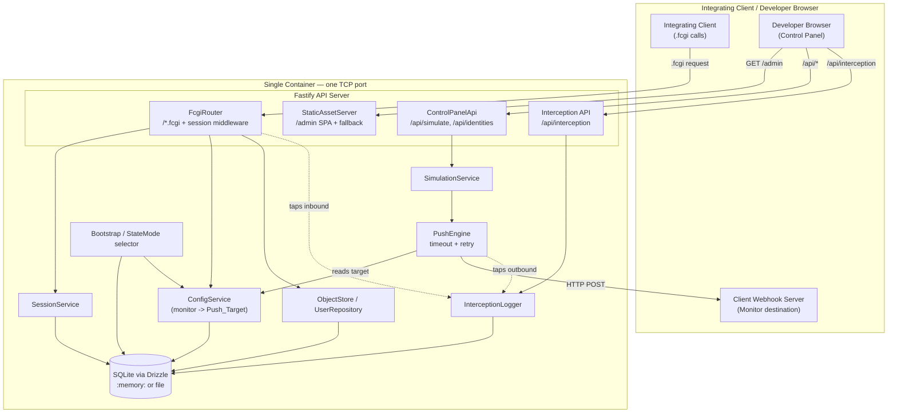

# Design Document: Control-iD Facial Emulator

## Overview

### Problem

Teams that integrate with Control-iD facial access control readers must currently
develop and test against physical hardware. Hardware is scarce, hard to share across a
team, awkward to script in CI, and impossible to run inside an ephemeral pipeline. The
Control-iD Facial Emulator removes that dependency by faithfully reproducing the reader's
HTTP (`.fcgi`) REST API, its configuration persistence, and its proactive Push/webhook
communication, packaged as a single "plug and play" Docker container with a built-in web
control panel.

### Goals

- Expose Control-iD-compatible `.fcgi` endpoints whose paths, HTTP methods, request field
  names, and response shapes match the Official API Documentation exactly (Req 1).
- Emulate the login/session flow with a 3600-second token TTL (Req 2).
- Persist configuration — in particular the Push/Monitor target — durably, with a
  documented default for every recognized key (Req 3).
- Answer log-query and biometry requests with structured data (Req 4).
- Dispatch outbound webhooks (the Monitor mechanism) to the configured target with a
  bounded timeout and retry policy (Req 5, Req 6).
- Serve a React control panel at `/admin` to trigger simulated events and inspect an
  interception log without any external HTTP client (Req 7, Req 8).
- Support both ephemeral (CI) and persistent (local dev) state modes (Req 9).
- Ship as a single lightweight (< 200 MB) Alpine container on one port (Req 10), backed
  by CI and CD pipelines (Req 11, Req 12) and clear documentation (Req 13).

### Fidelity Anchor

The single source of truth for endpoint and payload fidelity is the
[Control-iD Access API documentation](https://www.controlid.com.br/docs/access-api-pt/).
Every emulated request/response shape and every dispatched webhook payload in this design
is grounded in the concrete shapes published there (reproduced in the API and Push
catalog sections below). Where the emulator deliberately simplifies device behavior, the
divergence is called out explicitly and must be documented in the README (Req 13.5).

### Non-Goals

- **Not a biometric engine.** The emulator does not perform real face detection, template
  extraction, or 1:N matching. "Authorized" vs "denied" is a developer-selected outcome,
  not the result of a biometric comparison.
- **Not a security product.** Default credentials (`admin`/`admin`) mirror the device
  defaults for fidelity; the emulator is a development tool and must not be exposed to
  untrusted networks.
- **Not a full device firmware simulation.** Only the endpoints, configuration modules,
  and notification types required by the requirements (and listed in the API catalog) are
  emulated. Unlisted device features are out of scope.
- **Not a multi-device fleet simulator.** A single running container represents a single
  logical device identified by one `device_id`.

## Architecture

The emulator is a single Node.js process inside one container. Fastify serves four
logically distinct surfaces on **one TCP port**: the Control-iD `.fcgi` compatibility
routes, the static `/admin` SPA, the control-panel API (`/api/...`), and the interception
API. A Config Service mediates all reads/writes to SQLite (via Drizzle). Simulated events
flow through the Push Engine, which reads the Monitor target from config and POSTs to the
integrating client's server. The Interception Logger taps both the inbound request path
and the outbound dispatch path.

**Boundary note.** Everything inside `Container` is one process and one image. There are
no external services: SQLite is embedded, and the only network egress is the Push Engine's
POST to the client's Monitor server.

### Request/Dispatch flows

- **Inbound `.fcgi`:** request → InterceptionLogger.recordInbound → session middleware
  (for protected routes) → route handler → ConfigService/ObjectStore → JSON response.
- **Simulated event:** control panel → `POST /api/simulate/*` → SimulationService builds a
  grounded payload → PushEngine.resolvePushTarget (from ConfigService) → POST to target
  with timeout/retry → InterceptionLogger.recordOutbound → outcome returned to panel.

