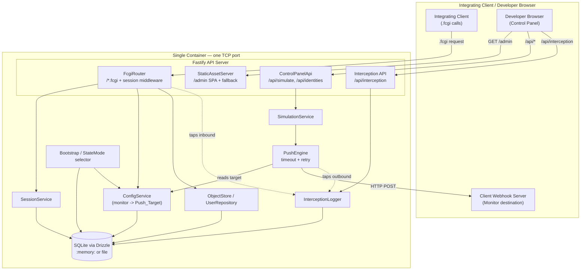

# Design Document: Control-iD Facial Emulator

## Overview

### Problem

Teams that integrate with Control-iD facial access control readers must currently
develop and test against physical hardware. Hardware is scarce, hard to share across a
team, awkward to script in CI, and impossible to run inside an ephemeral pipeline. The
Control-iD Facial Emulator removes that dependency by faithfully reproducing the reader's
HTTP (`.fcgi`) REST API, its configuration persistence, and its proactive Push/webhook
communication, packaged as a single "plug and play" Docker container with a built-in web
control panel.

### Goals

- Expose Control-iD-compatible `.fcgi` endpoints whose paths, HTTP methods, request field
  names, and response shapes match the Official API Documentation exactly (Req 1).
- Emulate the login/session flow with a 3600-second token TTL (Req 2).
- Persist configuration — in particular the Push/Monitor target — durably, with a
  documented default for every recognized key (Req 3).
- Answer log-query and biometry requests with structured data (Req 4).
- Dispatch outbound webhooks (the Monitor mechanism) to the configured target with a
  bounded timeout and retry policy (Req 5, Req 6).
- Serve a React control panel at `/admin` to trigger simulated events and inspect an
  interception log without any external HTTP client (Req 7, Req 8).
- Support both ephemeral (CI) and persistent (local dev) state modes (Req 9).
- Ship as a single lightweight (< 200 MB) Alpine container on one port (Req 10), backed
  by CI and CD pipelines (Req 11, Req 12) and clear documentation (Req 13).

### Fidelity Anchor

The single source of truth for endpoint and payload fidelity is the
[Control-iD Access API documentation](https://www.controlid.com.br/docs/access-api-pt/).
Every emulated request/response shape and every dispatched webhook payload in this design
is grounded in the concrete shapes published there (reproduced in the API and Push
catalog sections below). Where the emulator deliberately simplifies device behavior, the
divergence is called out explicitly and must be documented in the README (Req 13.5).

### Non-Goals

- **Not a biometric engine.** The emulator does not perform real face detection, template
  extraction, or 1:N matching. "Authorized" vs "denied" is a developer-selected outcome,
  not the result of a biometric comparison.
- **Not a security product.** Default credentials (`admin`/`admin`) mirror the device
  defaults for fidelity; the emulator is a development tool and must not be exposed to
  untrusted networks.
- **Not a full device firmware simulation.** Only the endpoints, configuration modules,
  and notification types required by the requirements (and listed in the API catalog) are
  emulated. Unlisted device features are out of scope.
- **Not a multi-device fleet simulator.** A single running container represents a single
  logical device identified by one `device_id`.

## Architecture

The emulator is a single Node.js process inside one container. Fastify serves four
logically distinct surfaces on **one TCP port**: the Control-iD `.fcgi` compatibility
routes, the static `/admin` SPA, the control-panel API (`/api/...`), and the interception
API. A Config Service mediates all reads/writes to SQLite (via Drizzle). Simulated events
flow through the Push Engine, which reads the Monitor target from config and POSTs to the
integrating client's server. The Interception Logger taps both the inbound request path
and the outbound dispatch path.



**Boundary note.** Everything inside `Container` is one process and one image. There are
no external services: SQLite is embedded, and the only network egress is the Push Engine's
POST to the client's Monitor server.

### Request/Dispatch flows

- **Inbound `.fcgi`:** request → InterceptionLogger.recordInbound → session middleware
  (for protected routes) → route handler → ConfigService/ObjectStore → JSON response.
- **Simulated event:** control panel → `POST /api/simulate/*` → SimulationService builds a
  grounded payload → PushEngine.resolvePushTarget (from ConfigService) → POST to target
  with timeout/retry → InterceptionLogger.recordOutbound → outcome returned to panel.

## Technology Stack and Rationale

| Concern | Choice | Rationale |
|---|---|---|
| Runtime / language | Node.js + TypeScript | Matches the intended stack; static types make the many grounded payload shapes self-documenting and safe to refactor. |
| HTTP framework | Fastify | Fast, schema-first (JSON Schema validation feeds Req 1.4/2.3/4.5 error handling), first-class static-file and hook support for the interception tap. |
| Persistence | SQLite via Drizzle ORM | Zero external dependencies keeps the image single-container and small (Req 10). Drizzle gives typed schema + migrations. Same schema serves file mode (persistent) and `:memory:` (ephemeral). |
| Frontend | React + Vite | Vite produces a static SPA build served from `/admin` (Req 7); fast DX. |
| Outbound HTTP | undici (Node's built-in `fetch` acceptable) | undici exposes explicit per-request timeout control (needed for the 10 s dispatch timeout, Req 5.6) and connection reuse. |
| Testing | vitest + fast-check | vitest for unit/integration; fast-check for property-based testing of the correctness properties. |
| Packaging | Docker multi-stage, `node:alpine` runner | Web build → API build → slim Alpine runner < 200 MB (Req 10.2). |
| CI/CD | GitHub Actions | Lint+test on push/PR (Req 11); semver-tag build/publish/release (Req 12). |

## Components and Interfaces

All interfaces are TypeScript. Types are illustrative signatures, not final implementation.

### FcgiRouter and route handlers

Registers every supported `.fcgi` route with its exact path, method, and request schema;
applies the session middleware to protected routes; produces documentation-shaped JSON.

```typescript
interface FcgiRouteContext {
  session?: SessionToken;      // populated by session middleware for protected routes
  deviceId: number;            // configured/synthetic device id
  logger: InterceptionLogger;
}

interface FcgiHandler<Req = unknown, Res = unknown> {
  path: `${string}.fcgi`;
  method: 'POST' | 'GET';
  protected: boolean;          // requires a valid session
  requestSchema: JSONSchema;   // Fastify JSON Schema -> 400 on violation (Req 1.4)
  handle(body: Req, ctx: FcgiRouteContext): Promise<Res>;
}

// Handlers: login, sessionIsValid, setConfiguration, getConfiguration,
// createObjects, loadObjects, modifyObjects, destroyObjects, userGetImage,
// newUserIdentified
```

The router registers a `404` handler for unknown paths (Req 1.5) and Fastify's method
mismatch yields `405` (Req 1.6). Session validation failures short-circuit to `401`
(Req 2.5).

### SessionService

Issues opaque tokens on successful login and validates them against a 3600 s TTL.

```typescript
interface SessionToken { token: string; issuedAt: number; expiresAt: number; }

interface SessionService {
  issue(): Promise<SessionToken>;                 // token = URL-safe random string
  validate(token: string | undefined): Promise<'valid' | 'expired' | 'invalid'>;
  readonly ttlSeconds: 3600;
}
```

### ConfigService

Reads/writes nested configuration modules (e.g. the `monitor` block) with defaults and
validation, and resolves the Push Target from the monitor block.

```typescript
interface MonitorConfig {
  request_timeout: string; hostname: string; port: string; path: string;
  alive_interval: number; enable_photo_upload: 0 | 1;
}

interface ConfigService {
  get(module: string, keys?: string[]): Promise<Record<string, unknown>>; // fills defaults (Req 3.4)
  set(patch: Record<string, Record<string, unknown>>): Promise<void>;     // all-or-nothing (Req 3.2)
  resolvePushTarget(): Promise<string | null>; // `${hostname}:${port}/${path}` or null (Req 5.1/5.5)
  getDefaults(): Record<string, Record<string, unknown>>;
}
```

`set` validates every key/value first; if any fails, it throws a `ValidationError`
identifying the rejected key and writes nothing (Req 3.2, 3.6 replace semantics).

### ObjectStore / UserRepository

CRUD over the Control-iD object model (`users`, `access_logs`, plus stubs for
`cards`/`templates`/`groups`/`portals` as needed) via Drizzle.

```typescript
interface ObjectStore {
  create(object: string, values: Record<string, unknown>[]): Promise<{ ids: number[] }>;
  load(object: string, filters?: Record<string, unknown>): Promise<Record<string, unknown>[]>;
  modify(object: string, values: Record<string, unknown>, where: Record<string, unknown>): Promise<{ changes: number }>;
  destroy(object: string, where: Record<string, unknown>): Promise<{ changes: number }>;
}

interface UserRepository {
  list(): Promise<UserRecord[]>;                 // feeds Control Panel identity picker (Req 7.3)
  getImage(userId: number): Promise<Buffer | null>;
  appendAccessLog(entry: AccessLogInsert): Promise<AccessLogRecord>;
}
```

### PushEngine

Dispatches webhooks with the timeout/retry policy and reports outcomes.

```typescript
interface PushOutcome {
  success: boolean;
  target: string | null;
  statusCode?: number;
  timedOut?: boolean;
  attempts: number;              // 1 + retries
  failureCategory?: 'no_target' | 'timeout' | 'unreachable' | 'http_error';
}

interface PushEngine {
  resolvePushTarget(endpoint: string): Promise<string | null>; // composes final URL
  dispatch(endpoint: string, payload: unknown): Promise<PushOutcome>;
  readonly timeoutMs: 10_000;    // Req 5.6
  readonly maxRetries: 3;        // Req 5.7  -> up to 4 attempts total
  readonly retryIntervalMs: 5_000;
}
```

If `resolvePushTarget` returns `null`, `dispatch` records `no_target` and performs no POST
(Req 5.5). Success is any `2xx` (Req 5.2). After exhausting attempts, the failed dispatch
is recorded with target, final status/timeout, and total attempts (Req 5.8).

### SimulationService

Builds correctly grounded payloads for each simulated event and delegates to the
PushEngine.

```typescript
interface SimulationService {
  simulateAuthorized(userId: number): Promise<PushOutcome>;  // event=7 dao (Req 6.1)
  simulateDenied(): Promise<PushOutcome>;                     // event=6 dao (Req 6.2)
  forceKeepAlive(): Promise<PushOutcome>;                     // device_is_alive (Req 6.3)
}
```

`simulateAuthorized` rejects with a domain error when `userId` is absent/unknown, so no
webhook is dispatched (Req 6.6). Each call also appends an `access_logs` record so that
subsequent `load_objects` queries reflect the event (Req 4.1).

### InterceptionLogger

Records inbound and outbound activity, enforces truncation and cap, and serves
newest-first queries.

```typescript
interface InterceptionRecord {
  id: number;
  direction: 'inbound' | 'outbound';
  method: string;
  path: string;                  // inbound path or outbound target URL
  timestamp: string;             // ISO 8601 UTC, millisecond precision
  body: string;
  truncated: boolean;            // Req 8.2 (> 64 KB)
  outcome?: 'success' | 'failure' | 'no_target';
  statusCode?: number;
  attempts?: number;
  failureCategory?: string;
}

interface InterceptionLogger {
  recordInbound(r: Omit<InterceptionRecord,'id'|'direction'>): Promise<void>;
  recordOutbound(r: Omit<InterceptionRecord,'id'|'direction'>): Promise<void>;
  query(limit?: number): Promise<InterceptionRecord[]>;       // newest-first (Req 8.5)
  readonly maxBodyBytes: 65_536; // 64 KB
  readonly capacity: 10_000;     // Req 8.7
}
```

Writes over 64 KB store the first 64 KB and set `truncated=true`. After each write, if the
row count exceeds `capacity`, the oldest rows are deleted to retain exactly 10,000
(Req 8.7).

### ControlPanelApi

The `/api` surface the React app calls. These are the emulator's own control endpoints,
distinct from the `.fcgi` compatibility surface.

```typescript
// GET  /api/identities            -> UserRecord[]   (Req 7.3)
// POST /api/simulate/authorized   { userId } -> PushOutcome (Req 6.1)
// POST /api/simulate/denied       {}         -> PushOutcome (Req 6.2)
// POST /api/simulate/keep-alive   {}         -> PushOutcome (Req 6.3)
// GET  /api/interception?limit=   -> InterceptionRecord[]   (Req 8.5)
```

Error responses carry a message the panel can surface without losing the developer's
selection (Req 6.5, 7.8).

### StaticAssetServer

Serves the built SPA at `/admin` and falls back to `index.html` for unknown sub-paths so
client-side routing resolves (Req 7.1, 7.2).

### Bootstrap / StateMode selector

Selects ephemeral vs persistent storage from the environment, verifies the persistent
volume, initializes defaults, then binds the port.

```typescript
type StateMode = 'ephemeral' | 'persistent';

interface Bootstrap {
  resolveMode(env: NodeJS.ProcessEnv): { mode: StateMode; warning?: string }; // Req 9.6 default+warn
  openStore(mode: StateMode): Promise<DrizzleDb>; // :memory: or file on volume
  ensureVolumeWritable(path: string): Promise<void>; // Req 9.5 abort if missing
  initDefaultsIfEmpty(cfg: ConfigService): Promise<void>; // Req 9.3
}
```

Persistent mode with an unwritable/absent volume aborts startup with a non-zero exit and a
clear message, without listening (Req 9.5, 10.4). An unrecognized/absent mode defaults to
ephemeral and emits a warning (Req 9.6).

## Data Models

Drizzle schema (SQLite). Timestamps are stored as ISO 8601 UTC strings with millisecond
precision for the interception log; other time fields mirror the device's Unix-epoch
string/number conventions for fidelity.

```typescript
import { sqliteTable, integer, text } from 'drizzle-orm/sqlite-core';

// Configuration stored per module as a JSON blob keyed by module name.
export const config = sqliteTable('config', {
  module: text('module').primaryKey(),      // e.g. 'monitor'
  json: text('json').notNull(),             // serialized Record<string, unknown>
  updatedAt: text('updated_at').notNull(),  // ISO 8601 UTC
});

export const users = sqliteTable('users', {
  id: integer('id').primaryKey({ autoIncrement: true }),
  registration: text('registration').notNull(),
  name: text('name').notNull(),
  password: text('password'),
  imagePath: text('image_path'),            // optional stored face image
});

export const accessLogs = sqliteTable('access_logs', {
  id: integer('id').primaryKey({ autoIncrement: true }),
  time: text('time').notNull(),             // Unix epoch seconds (string, device shape)
  event: text('event').notNull(),           // '7' granted, '6' denied, '3' not identified
  deviceId: text('device_id').notNull(),
  identifierId: text('identifier_id').notNull().default('0'),
  userId: text('user_id').notNull().default('0'),
  portalId: text('portal_id').notNull().default('1'),
  identificationRuleId: text('identification_rule_id').notNull().default('0'),
  cardValue: text('card_value').notNull().default('0'),
  logTypeId: text('log_type_id').notNull().default('-1'),
});

export const sessions = sqliteTable('sessions', {
  token: text('token').primaryKey(),
  issuedAt: integer('issued_at').notNull(),   // epoch ms
  expiresAt: integer('expires_at').notNull(),  // issuedAt + 3600_000
});

export const interceptionLog = sqliteTable('interception_log', {
  id: integer('id').primaryKey({ autoIncrement: true }),
  direction: text('direction').notNull(),       // 'inbound' | 'outbound'
  method: text('method').notNull(),
  path: text('path').notNull(),                 // inbound path or outbound target URL
  timestamp: text('timestamp').notNull(),       // ISO 8601 UTC, ms precision
  body: text('body').notNull(),
  truncated: integer('truncated', { mode: 'boolean' }).notNull().default(false),
  outcome: text('outcome'),                     // 'success' | 'failure' | 'no_target'
  statusCode: integer('status_code'),
  attempts: integer('attempts'),
  failureCategory: text('failure_category'),
});
```

Ordering for the interception view uses `id DESC` (monotonic with insertion), which is a
faithful proxy for newest-first even when timestamps tie at millisecond precision.


## API / Endpoint Specification

### Emulated Control-iD `.fcgi` endpoints

All shapes are grounded in the Official API Documentation. Content-Type is
`application/json` for both request and response unless noted (Req 1.2). The session token
is passed as `?session=<token>` on protected routes.

| Path | Method | Auth | Request shape | Response shape |
|---|---|---|---|---|
| `/login.fcgi` | POST | No | `{ "login": "admin", "password": "admin" }` | `{ "session": "apx7NM2CErTcvXpuvExuzaZ" }` |
| `/session_is_valid.fcgi` | POST | No | `{ "session": "<token>" }` | `{ "session_is_valid": true }` |
| `/set_configuration.fcgi` | POST | Yes | `{ "monitor": { "hostname": "192.168.0.20", "port": "8000", "path": "api/notifications", "alive_interval": 30000, "enable_photo_upload": 1, "request_timeout": "5000" } }` | `{}` (200 success) |
| `/get_configuration.fcgi` | POST | Yes | `{ "monitor": ["alive_interval"] }` | `{ "monitor": { "alive_interval": "30000" } }` |
| `/create_objects.fcgi` | POST | Yes | `{ "object": "users", "values": [{ "registration": "0123", "name": "Walter White", "password": "Heisenberg" }] }` | `{ "ids": [8] }` |
| `/load_objects.fcgi` | POST | Yes | `{ "object": "access_logs", "where": { ... } }` | `{ "access_logs": [ { ... } ] }` |
| `/modify_objects.fcgi` | POST | Yes | `{ "object": "users", "values": {...}, "where": {...} }` | `{ "changes": 1 }` |
| `/destroy_objects.fcgi` | POST | Yes | `{ "object": "users", "where": {...} }` | `{ "changes": 1 }` |
| `/user_get_image.fcgi` | GET/POST | Yes | `?user_id=8` | `application/octet-stream` (image bytes) |
| `/new_user_identified.fcgi` | POST | No* | `application/x-www-form-urlencoded`: `device_id, identifier_id, event, user_id, user_name, time, portal_id, uuid, confidence, face_mask` | `{ "result": { "event": 7, "user_id": 6, "user_name": "Neal Caffrey", "user_image": false, "portal_id": 1, "actions": [ { "action": "door", "parameters": "door=1" } ], "message": "..." } }` |

\* `new_user_identified.fcgi` models the online-identification callback a device sends to a
server; the emulator implements the "Mensagem de Retorno" reply shape. Event codes:
`7` = access granted, `6` = access denied, `3` = not identified; `duress` = `1` panic /
`0` normal.

Validation: bodies that are not valid JSON, are missing required fields, or carry a field
of the wrong type return `400` with an `error-description` field and no state change
(Req 1.4, 4.5). Unknown paths → `404` with `error-description` (Req 1.5). Wrong method →
`405` (Req 1.6). Missing/expired/invalid session on a protected route → `401` (Req 2.5).

### Control Panel API (`/api/...`)

| Path | Method | Request | Response |
|---|---|---|---|
| `/api/identities` | GET | — | `UserRecord[]` (identity picker source, Req 7.3) |
| `/api/simulate/authorized` | POST | `{ "userId": 8 }` | `PushOutcome` (Req 6.1); `400` if `userId` missing (Req 6.6) |
| `/api/simulate/denied` | POST | `{}` | `PushOutcome` (Req 6.2) |
| `/api/simulate/keep-alive` | POST | `{}` | `PushOutcome` (Req 6.3) |

### Interception API

| Path | Method | Request | Response |
|---|---|---|---|
| `/api/interception` | GET | `?limit=<n>` (optional) | `InterceptionRecord[]`, newest-first (Req 8.5); empty array when none (Req 8.6 empty-state) |

## Push / Webhook Payload Catalog

The Monitor mechanism POSTs to `hostname:port/path/<endpoint>`. The Push Target base is
composed from the `monitor` configuration block:

```
Push_Target(endpoint) = "http://" + monitor.hostname + ":" + monitor.port
                        + "/" + monitor.path + "/" + endpoint
```

Example: `hostname=192.168.0.20`, `port=8000`, `path=api/notifications`, endpoint `dao`
→ `http://192.168.0.20:8000/api/notifications/dao`. If `hostname`/`port`/`path` are unset
(no target), the Push Engine records `no_target` and does not POST (Req 5.5).

### 1. Authorized access — `POST .../dao` (event `7`)

Dispatched by `simulateAuthorized(userId)` (Req 6.1). Grounded in the `dao` log-change
shape:

```json
{
  "object_changes": [
    {
      "object": "access_logs",
      "type": "inserted",
      "values": {
        "id": "519", "time": "1532977090", "event": "7",
        "device_id": "478435", "identifier_id": "0",
        "user_id": "8", "portal_id": "1",
        "identification_rule_id": "0", "card_value": "0", "log_type_id": "-1"
      }
    }
  ],
  "device_id": 478435
}
```

Optionally, when `enable_photo_upload=1`, a companion `POST .../access_photo` carries the
base64 JPEG identification photo.

### 2. Denied access — `POST .../dao` (event `6`)

Dispatched by `simulateDenied()` (Req 6.2). Same `dao` envelope with `event": "6"` and
`user_id": "0"`.

### 3. Keep-alive — `POST .../device_is_alive`

Dispatched by `forceKeepAlive()` (Req 6.3). Grounded in the keep-alive shape:

```json
{ "access_logs": 0, "device_id": 6613047045004349, "time": 1739376235 }
```

### Additional catalog shapes (for completeness / future events)

- `POST .../operation_mode` — `{ "operation_mode": { "mode": 0, "mode_name": "DEFAULT", "time": 1490271121, "last_offline": 1490261121, "exception_mode": "none" }, "device_id": 123456 }`
- `POST .../door` — `{ "door": { "id": 1, "open": true }, "access_event_id": 15, "device_id": 1038508, "time": 1575475894 }`

## Error Handling

| Condition | Response / behavior | Requirement |
|---|---|---|
| Invalid JSON, missing required field, or wrong field type on a `.fcgi` route | `400` + `error-description` naming the failed rule; no state change | 1.4 |
| Unknown endpoint path | `404` + `error-description`; no state change | 1.5 |
| Wrong HTTP method for a known route | `405` | 1.6 |
| Login credentials mismatch | `401`, no session token, failure body | 2.2 |
| Login missing username/password | `400`, body names the missing field | 2.3 |
| Protected route with no/empty/malformed/expired session | `401`, command not processed | 2.5 |
| Config change with unrecognized key or invalid value | Reject whole request, store unchanged, validation error names rejected key | 3.2 |
| Log/biometry filter unrecognized or invalid | `400`, no records, `error-description` names the parameter | 4.5 |
| No Push Target configured on simulate | Record `no_target` in log; no POST | 5.5 |
| Push timeout / unreachable / non-2xx after all retries | Record failure with target, final status/timeout, total attempts; surface error to developer keeping selection | 5.8, 6.5 |
| Persistent mode but volume missing/unwritable | Abort startup, non-zero exit, error message, do not listen | 9.5, 10.4 |
| Unknown/absent state mode | Default to ephemeral + emit warning | 9.6 |
| Missing/invalid required env var or dependency at startup | Terminate with non-zero exit + specific log message, do not listen | 10.4 |

Push failures are categorized (`timeout`, `unreachable`, `http_error`, `no_target`) and
each category, plus the HTTP status code when available, is recorded on the interception
record (Req 8.4).

## Configuration and Deployment

### Environment variables

| Variable | Purpose | Accepted values | Default |
|---|---|---|---|
| `EMULATOR_STATE_MODE` | Select state mode | `persistent` \| `ephemeral` | `ephemeral` (with warning if unset/unknown, Req 9.6) |
| `EMULATOR_DB_PATH` | SQLite file path (persistent mode) | filesystem path on mounted volume | `/data/emulator.sqlite` |
| `EMULATOR_PORT` | Listen port | 1–65535 | `8080` |
| `EMULATOR_DEVICE_ID` | Synthetic device id used in payloads | integer | generated synthetic id |
| `EMULATOR_LOGIN` | Admin username | ≤ 64 chars | `admin` |
| `EMULATOR_PASSWORD` | Admin password | ≤ 64 chars | `admin` |

Ephemeral mode uses SQLite `:memory:` (or a temp file discarded on stop); persistent mode
uses `EMULATOR_DB_PATH` on the mounted volume (Req 9.1, 9.2).

### Dockerfile (multi-stage plan)

1. **web build** (`node:alpine`): install web deps, `vite build` → static assets.
2. **api build** (`node:alpine`): install api deps, `tsc` build, prune dev deps.
3. **runner** (`node:alpine`): copy compiled API + static assets + production deps only;
   `EXPOSE 8080`; `CMD ["node", "dist/main.js"]`. Target final image < 200 MB (Req 10.2),
   single port (Req 10.1), ready within 10 s (Req 10.3).

### docker-compose.yml (outline)

```yaml
services:
  emulator:
    build: .
    ports: ["8080:8080"]              # host:container (Req 10.5)
    environment:
      EMULATOR_STATE_MODE: persistent
    volumes:
      - emulator-data:/data           # persistent-mode volume (Req 9.1)
volumes:
  emulator-data:
```

### CI workflow (GitHub Actions)

On `push` to `main` and on `pull_request` (opened/synchronize/reopened): checkout →
install → **lint** → **test** (vitest, including property tests). Lint failure or any test
failure fails the run and records the failing step; all-green reports success. Job timeout
15 min (Req 11.1–11.6).

### CD workflow (GitHub Actions)

Trigger on tag matching `v[0-9]+.[0-9]+.[0-9]+`. Non-matching tags do no build/publish
(Req 12.2). Steps: `docker buildx` build → on build failure stop without publishing
(Req 12.3) → push to Docker Hub as `<version>` (tag minus leading `v`) and `latest`
(Req 12.4, 12.5) → on publish failure fail and skip release (Req 12.6) → create GitHub
release named with the tag, changelog = commit messages since previous semver tag
(Req 12.7).


